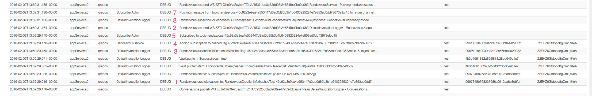
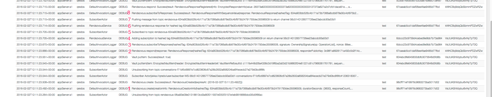
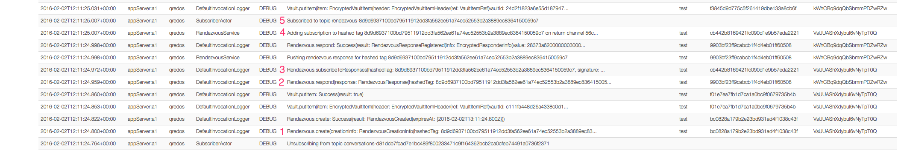

# IOS SDK Rendezvous Subscribe Failure

**Process:**

* Client 1: A Rendezvous [R1] is created [client createAnonymousRendezvousWithTag . . .
* Client 1: Subscribes to receive Notifcations of any responces to [R1]
* Client 2: Responds to rendezvous [R1]
* Client 1: Recieves notification via delegate (didReceiveReponse) of Client2’s rendezvous response.

**Issue:**

 When this functionality is tested at speed and continuously, an intermittant error is produced where Client 1 doesn’t receive the final notification.

 In most test runs the error doesnt occur and the following logs similar to the following will be produced on the server

**Fig1 - Successful**

 Note \#3 Subscribe comes before \#2 Respond - whihc based on the Process above is what you would expect.

**Fig2 - Successful **

Due to how the servers commincate between different instances, and because the delay is short (0.04 seconds) between \#3 & \#2, even though the subscribe comes after the respond, this also (suprisingly) works.

**
**

**Fig3 - Failure**

In the following case the operation fails.

In this case the respond \#2 comes before the subscribe as in Fig2, but the gap between \#2 and \#3 is 0.13 seconds, so the subscriber is not notified.

The fix:

Even though the Process clearly registers the subscriber before the rendevous is reponded to, because of the multi server arrangement and the time taken for inter server communication, it takes time to process this request and needs to be delayed before it is permitted to respond.

The simple fix in the test case (ConversationWebSocketTests/testConversationMultiple)  is to insert a delay (0.2 seconds should be sufficient) between the creation of the Rendezvous, and the automatic subscription on Client 1 and any Response from Client 2